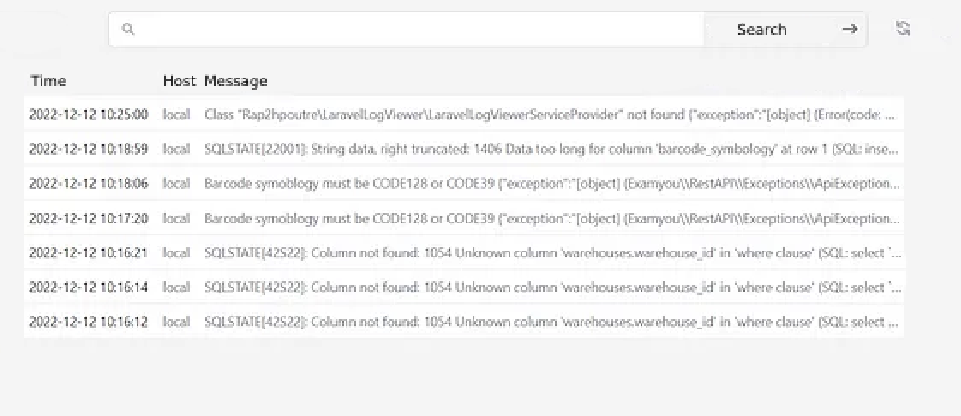

### Resumen 

Almacenar los logs del fichero json en una colección de MongoDB.
Crear una API para poder acceder y trabajar con los datos, crear un front para poder visualizar e interactuar con los datos, utilizando la API como intermediario entre el front y la base de datos

### Detalles tecnicos
La prueba consta en tres partes, las cuales tendrán que funcionar correctamente y en su conjunto.

1.  **Base de Datos con MongoDB**
2.  **ServerSide con Node.js**
3.  **Frontend con React**

A continuación, se detallan los objetivos y recomendaciones para cada sección.
Front y back funcionaran en localhost.

### 1. Base de Datos, MongoDB:

**Objetivo:**

-   Conectarse e interactuar con MongoDB.
-   Crear un script para la importación de objetos a MongoDB.

**Explicación:**

Se tiene un archivo  `logs.json`  con múltiples registros de servicios, cada uno como un objeto JSON en líneas separadas. Los requerimientos son:

1.  Formatear los registros extrayendo únicamente "dt", "message" y "host".
2.  Importar los registros formateados a una nueva colección en MongoDB, tratando cada objeto log como un documento distinto.

Es esencial no modificar manualmente el archivo  `./logs`. Este script es para uso inicial para precargar la base de datos y no tiene que integrarse con el backend o frontend.

**Recomendaciones:**

-   Utilizar librerías npm como  `mongodb`  o  `mongoose`.
-   Desarrollo en un entorno Node.js.

### 2. ServerSide, Node.js:

**Objetivo:**

-   Conexión e interacción con MongoDB.
-   Creación de endpoints de API para manejar peticiones POST & GET.
-   Ejecutar consultas en MongoDB en respuesta a peticiones válidas.
-   Realizar búsquedas  por substring en MongoDB.

**Explicación:**

El backend, utilizando Node.js, debe establecer conexión con MongoDB e implementar un API endpoint accesible. Las peticiones realizadas al endpoint deben traducirse en consultas por subcadena en MongoDB, devolviendo los resultados en un formato interpretable por el frontend.

**Recomendaciones:**

-   Emplear librerías npm como  `mongodb`  o  `mongoose`  y  `express`  o similares para la creación del servidor.

### 3. Frontend, React:

**Objetivo:**

-   Construcción de un frontend utilizando React.
-   Diseño de una interfaz con campo de entrada (input) y botón de búsqueda.
-   Enviar peticiones al backend y mostrar las respuestas recibidas.
-   Aplicación de estilos a los elementos de la interfaz.

#### Ejemplos de pagina terminada 	

Ejemplo1

Ejemplo2
